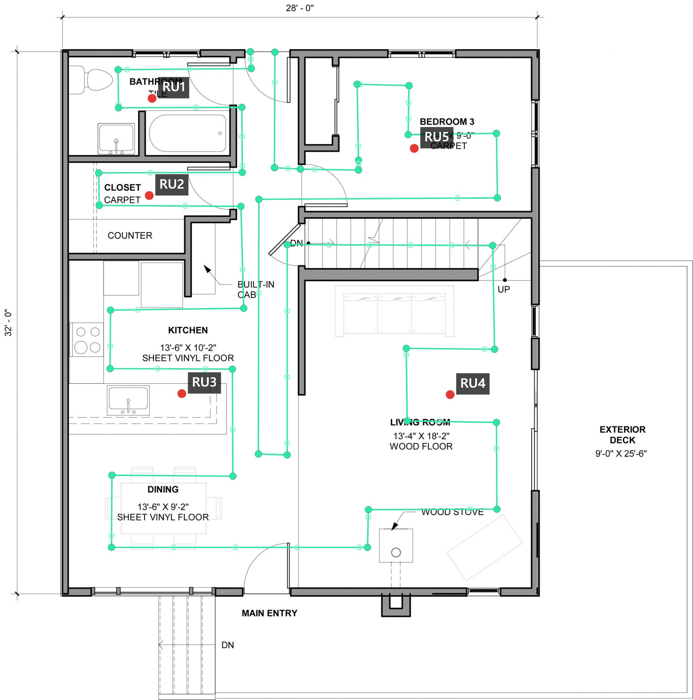

# Walkplotter

A small **offline-friendly** web app for walking a path on a floor plan: drop **trail** pins with timestamps, add **points of interest markers (POI markers)**—labeled pins not on the trail—pinch-zoom and pan, then export **CSV** (and optional map snapshot **JPG**). Built with **Vite** and **TypeScript**; runs in the browser with no backend.

**Typical use case:** **uplink signal coverage walk testing** alongside [**dBm-Now**](https://github.com/Cloolalang/dBm-Now-), an ESP-NOW path-loss / RSSI project. You walk the indoor coverage area with a **signal source** while Walkplotter records your **route on a floor plan** with timestamps; a **transponder** elsewhere receives the signal and logs **levels with timestamps** (for example via Serial CSV). **Post-processing the two timestamped CSV files** lets you align path and measurements to build **uplink coverage plots** for **in-building DAS** commissioning and design. As of **version 2.0**, the in-browser **Process** tab loads your Walkplotter export and path-loss log, matches them by time, and draws **path-loss–colored** markers and optional **histogram**, **point labels**, thin **route** line, and a **color-coded trail** (continuous ribbon the same width as the markers)—no spreadsheet required for a first look.



---

## Features (short)

- Load a floor plan image; trail and POI markers are stored in **image pixel** coordinates.
- **Trail** mode records taps with local time; optional interpolation along straight segments when taps are more than 1 second apart.
- **POI** mode for separate labeled pins (anything you want to mark on the map without a timestamp); optional second CSV export (pixels only, no timestamps).
- **Map** / **Controls** / **Process** tabs: large map, tools and export, and **post-processing** (path loss on the floor plan).
- Pin size, crosshairs, pause/resume, undo, CSV download.
- **Process** tab: **zoom and pan** (View bar, wheel, drag; with **Nudge trail**, **left-drag** on empty space, **middle-drag**, or **Alt + drag** to pan); **nudge trail** pixels and **save** CSV; **Plot path loss** with fixed **−30…−100 dB** scale (path loss from your CSV), optional **FSPL frequency estimate** (free-space **Δ** dB only—**indicative / experimental**; see Process manual), **20 dB histogram** (count, **seconds** of walk per bin, %), optional **Point labels**, **Show route** (thin polyline), and **Color-coded trail** (continuous stroke with per-segment gradient; **with 2+ plotted points** hides the circular markers so only the ribbon shows). **Original** walk samples (**user**) use a **grey ring**; **interpolated** samples have **no ring**—in **trail preview** and on the path-loss overlay when markers are visible (fill color encodes path loss in **dB**).

---

## Getting started (user manual)

### Open the app

Run the dev server (`npm run dev`) and open the URL shown in the terminal, or serve the **`dist/`** folder after `npm run build` (see **Setup on a computer** and **Android smartphone** below). The UI has three tabs: **Map** (full map), **Controls** (tools and export), and **Process** (combine trail and path-loss data on a plan).

### Load a floor plan

1. Open the **Controls** tab.
2. Tap **Choose floor plan** and pick an image (or use your project’s default test image if configured).
3. Return to **Map** to work on the image. Taps **on the image** count; taps on the letterboxed area outside the image are ignored.

### Trail mode (walked path with timestamps)

1. In **Controls**, ensure **Trail** is selected (not **POI**).
2. Tap the map to drop **trail pins**. Each pin gets a **local timestamp** (time of day); the exported CSV uses `HH:MM:SS` and a test date in the header.
3. **Pause** stops recording new trail pins (for example before you move to another area). **Resume** continues the same trail. Pausing inserts a **segment break** so the next tap does not connect with a line to the previous segment.
4. **Crosshairs** (optional) draws guide lines through your last **user** pin to help align the next tap along horizontal or vertical lines.
5. **Interpolation step**: if two trail taps are **more than one second apart**, Walkplotter adds synthetic points along the **straight line** between them, spaced by this interval (seconds). Adjust the value under Controls when a plan is loaded.

### POI mode (points of interest)

1. Select **POI** in Controls. Recording pause rules do not apply here; you can place POIs while the trail is paused or active.
2. Tap the map, enter a **label** in the dialog, and confirm. POI markers are **red labeled pins**, not linked to the trail, and have **no timestamps**.
3. Use **Undo POI** / **Clear POI** to remove the last POI or all POIs.

### Map navigation and appearance

- **Pinch** to zoom, **drag** with one finger to pan. On a **desktop**, **mouse wheel** zooms and **drag** pans the map. Under Controls, use **Map** − / + and **Reset view** if you prefer buttons.
- **Pin size** scales trail pins, the trail line, and POI markers on screen (export coordinates are unchanged).

### Exporting data

| Action | What it does |
|--------|----------------|
| **Download CSV** | Downloads the **combined** CSV: trail section (if any) plus a **POI markers** section in the same file when you have POIs. Enabled when you have at least one trail pin or one POI. |
| **POI CSV** | Downloads a **POI-only** CSV (label + `x,y` image pixels, no timestamps). Enabled when you have at least one POI. |
| **Stop & save…** | Opens a **Save** dialog: choose file names, optionally add a **map snapshot JPG**, and optionally a **separate POI-only CSV**. Available while recording **or** after **Pause** if you have trail and/or POI data to export. |

**Save dialog notes**

- If you have a **trail**, you name the **trail CSV** first. Trail and POI can live in that single file; a **separate POI CSV** is **optional** and is **off by default**—turn it on only if you want that extra file.
- If you have **only POIs** (no trail pins), there is no trail CSV field. Choose whether to **save POI markers as CSV** and/or a **JPG**; you must enable **at least one** of those (or cancel).

### Process tab (path loss on the floor plan)

Use this after you have a **Walkplotter trail CSV** (from **Download CSV** or **Stop & save…**) and a separate **path-loss log** as CSV from your receiver/tooling (e.g. Serial export). All processing stays in the browser.

For **best usability**, do the **Process** tab work on a **PC with a mouse** (wheel zoom, pan, and nudge trail are tuned for that). A phone or touchscreen still works, but desktop is more comfortable for zooming, panning, and dragging trail points.

**Process floor plan view:** After you load a floor plan, use the **View** bar (− / + / **Reset view**) or the **mouse wheel** over the plan to zoom; **drag** on empty space to **pan**. With **Nudge trail** on, **left-drag** on empty space (not on a trail dot) pans the view like the middle button; **middle-drag** or **Alt + drag** still work anywhere on the overlay. Touch devices can use **pinch** to zoom and two-finger gestures where supported.

**Original vs interpolated trail points:** The Walkplotter CSV marks each row with a **source** (`user` = your taps, `interpolated` = synthetic points along straight segments). On the Process map, **original** points show a **grey ring** around the dot; **interpolated** points have **no ring** (green trail before **Plot path loss**). After **Plot path loss**, the same ring convention applies when **disks** are drawn; turning **Color-coded trail** on with **two or more** points hides disks and shows only the ribbon. Fill color encodes **path loss (dB)** from your log where markers or the ribbon are shown. A **legend** lists original vs interpolated counts when relevant.

1. Open the **Process** tab.
2. Choose **Floor plan** (the **same** image as the walk) and **Walkplotter CSV**. The trail appears as green dots (and a line); **original** vs **interpolated** samples match the **grey ring** / **no ring** rule above. The CSV should include `# test_date_local: YYYY-MM-DD` for time alignment when you plot path loss.
3. **Optional — straighten the trail:** turn on **Nudge trail**, then **drag** dots to adjust **image pixel** `x,y` in memory (nudge works at any zoom level). **Snap angles** can lock segments to **90°** (horizontal/vertical) or **45°** (8-way): from the **previous** point only at the **start** of the trail, from the **next** point only at the **end**, and using **both** neighbors for **middle** points (intersection of snapped incoming and outgoing directions). Use **Reset trail** to reload pixels from the file you chose. When satisfied, use **Save as edited copy** (`…-edited.csv`) or **Save (original name)** so the browser’s save dialog can replace the loaded file if you choose the same path. **Plot path loss** always uses the trail **currently in memory** (including unsaved nudges).
4. Choose **Path loss CSV** — comma-separated rows: **column 1** = `HH:MM:SS`, **column 4** = path loss (dB from your test gear). Lines starting with `#` are ignored.
5. Tap **Plot path loss**. Each trail sample is matched to the **nearest** path-loss row in time (same date), within **3 seconds** or the point is skipped.
6. **Optional — FSPL frequency estimate (after plotting):** Turn on **FSPL frequency estimate**. Your walk is always at **2.4 GHz** — choose **Measured at (2.4 GHz)** (**2400** or **2474** MHz, default **2474**). Pick **Estimate at** (**700–2300 MHz**, 50 MHz steps) for the band you care about. The app applies only the **free-space** frequency term: **PL_est = PL_meas + 20·log₁₀(f_est / f_meas)** when your CSV uses **positive** path loss (dB). If your gear reports path loss as **negative** numbers (e.g. −51 dB), the app **flips the sign** of that correction so a **lower** estimate frequency still moves values toward **less** loss (less negative).

   **Limitations (read this):** The FSPL estimator is **not** a full propagation model. It does **not** account for **antenna performance** (gain, pattern, efficiency) at the estimate frequency vs 2.4 GHz, **in-building clutter** and multipath, **absorption** in walls and materials, **body / furniture** loss, or **cable and connector** losses. It is **indicative and experimental**—a quick free-space **what-if** for the same geometric path—not a substitute for measurements, drive tests, or proper modeling at the target band.
7. **Map (after plotting):** Each matched sample is placed at trail coordinates. **Default:** path-loss–colored **circles** (same palette: **−30 dB** light blue through warm/cool tones toward **−70 dB**, **greys** toward **−100 dB**; out-of-range values **clamped** for color). **Original** samples: **grey ring**; **interpolated**: **no ring** (legend summarizes counts). Optional toggles (toolbar):
   - **Point labels** — path loss in **dB** next to each sample (offset adjusts if markers are hidden).
   - **Show route** — thin semi-transparent polyline along consecutive plotted points in walk order.
   - **Color-coded trail** — continuous stroke **along the same path**, **line width = circle diameter**, each segment a **linear gradient** between the two endpoints’ path-loss colors. With **two or more** points, **markers and rings are hidden** so only the ribbon is drawn; with **one** point, the disk is still shown (no segment to form a ribbon).
   - **Histogram** (20 dB bins): **Count**, **Seconds** (sum of trail time to the next plotted point for samples in that bin, from Walkplotter timestamps), and **%** of samples.
8. **Clear path loss plot** removes the overlay and histogram so you can **nudge the trail** again; it does not reload the CSV files.

Selected file **names** are listed under the buttons so you can confirm what is loaded. Changing the **floor plan** clears the Walkplotter and path-loss selections so coordinates stay consistent.

**Summary:** maximum tolerated **timestamp offset** between a trail row and the path-loss row used for it is **3 seconds** (nearest-neighbor within that window).

**How path loss values are chosen:** Walkplotter does **not** linearly interpolate **between** receiver measurements. For each trail row (including interpolated trail points), it uses the **value from the single nearest** path-loss row in time, as long as that row is within **3 seconds**. So the plotted color always reflects an **actual** value from your log, not a blend of two samples. In practice you might log RF at a **fixed interval** (for example **one sample per second / 1000 ms**); that cadence is **your choice**—the app does not assume a particular spacing, only that timestamps align with `# test_date_local` and fall inside the 3 s match window.

### Tips

- **Undo trail** / **Clear trail** affect only the walked path; POIs are separate.
- After **Pause**, you can still use **Stop & save…** or **Download CSV** so you do not need trail pins to finish a POI-only session.
- All coordinates are stored in **image pixel** space (origin top-left), matching the floor plan file.
- **Process:** Use **Clear path loss plot** to remove the overlay and histogram and **nudge** the trail again (CSV files stay selected; reload the walk file if you need a fresh copy). Combine **Show route** with or without **Color-coded trail** depending on whether you want a thin reference line under or beside the ribbon.
- **FSPL frequency estimate:** Free-space math only—no antennas, clutter, or absorption (see step 6). Treat as **indicative**, not a commissioning guarantee.

---

## Prerequisites (on your PC)

- [Node.js](https://nodejs.org/) (LTS is fine)

---

## Dependencies (build) and tested browser

The app itself has **no runtime npm dependencies**; the UI is bundled for static hosting. **Development / build** tools are listed in `package.json` and resolved in `package-lock.json`. Current locked versions:

| Package | Version |
|---------|---------|
| [TypeScript](https://www.typescriptlang.org/) | 5.9.3 |
| [Vite](https://vite.dev/) | 8.0.3 |

**Tested on Android:** **Google Chrome** version **111.0.5563.116** (floor plan loading, trail/POI, pinch–zoom, pan, CSV/JPG export over local HTTP).

---

## Setup on a computer

```bash
cd walkplotter
npm install
```

### Development server

```bash
npm run dev
```

Then open the URL shown in the terminal (default port **4173**). On a phone on the same Wi‑Fi, use your PC’s LAN IP, e.g. `http://192.168.1.50:4173` (firewall may need to allow the port).

### Production build

```bash
npm run build
```

Output is in the **`dist/`** folder. That folder is what you copy to the phone for offline use (see below).

---

## Android smartphone: offline use with **Simple HTTP Server** + **Chrome**

Opening `dist/index.html` directly from storage often **fails** in mobile Chrome (modules / security). Serving the folder over **HTTP on the device** avoids that and works **fully offline** after the files are on the phone.

### 1. Build on your PC

```bash
npm run build
```

### 2. Copy `dist` to the phone

Copy the entire **`dist`** directory (including the **`assets`** folder next to `index.html`) via USB, cloud drive, etc. For example: `Downloads/walkplotter-dist/`.

### 3. Install a tiny HTTP server app

Examples: **Simple HTTP Server** (Phlox) or similar from the Play Store—anything that lets you pick a **folder** and start a server on **127.0.0.1**.

### 4. Point the app at your `dist` folder

- **Document root / web root** = the folder that **contains** `index.html` (not its parent).
- Start the server and note the port (e.g. **8080**).

### 5. Open in Chrome

On the phone, in **Chrome**, open:

**`http://127.0.0.1:8080/`**

(use your app’s actual port). Use **127.0.0.1** for “this phone only”—no internet required.

If the app shows a **public/WAN** IP, ignore it for local-only use; **127.0.0.1** is the right address here.

### 6. Updating the app

After you change the project on the PC, run `npm run build` again and **replace** the `dist` contents on the phone, then refresh the page in Chrome.

---

## Add Walkplotter to your Android home screen

This gives you a one-tap shortcut (usually full-screen Chrome without the address bar after launch).

1. With Walkplotter open in **Chrome** at your `http://127.0.0.1:…` URL.
2. Open Chrome’s menu (**⋮**).
3. Choose **Add to Home screen** or **Install app** (wording varies by Chrome version).
4. Confirm the name and add the icon.

**Note:** The shortcut opens that URL. **Simple HTTP Server** must be running first, or the page will not load—start the server, then tap the home screen icon.

---

## Permissions note (Simple HTTP Server)

Some server apps ask for broad storage access so they can read any folder you select. If you prefer not to grant that, alternatives include **Termux** (`python -m http.server` in the `dist` directory) or packaging the app with **Capacitor** (no separate server app).

---

## Project scripts

| Command        | Purpose                          |
|----------------|----------------------------------|
| `npm run dev`  | Dev server (default port 4173)   |
| `npm run build`| Typecheck + production `dist/`   |
| `npm run preview` | Serve `dist/` locally (test) |

---

## Development

This project was developed using [Cursor](https://cursor.com/).

---

## License

**Walkplotter** is free software; you can redistribute it and/or modify it under the terms of the **GNU General Public License version 2** (or, at your option, any later version). See the [LICENSE](LICENSE) file in this repository for the full text.

THE SOFTWARE IS PROVIDED "AS IS", WITHOUT WARRANTY OF ANY KIND, EXPRESS OR IMPLIED, INCLUDING BUT NOT LIMITED TO THE WARRANTIES OF MERCHANTABILITY, FITNESS FOR A PARTICULAR PURPOSE AND NONINFRINGEMENT.
