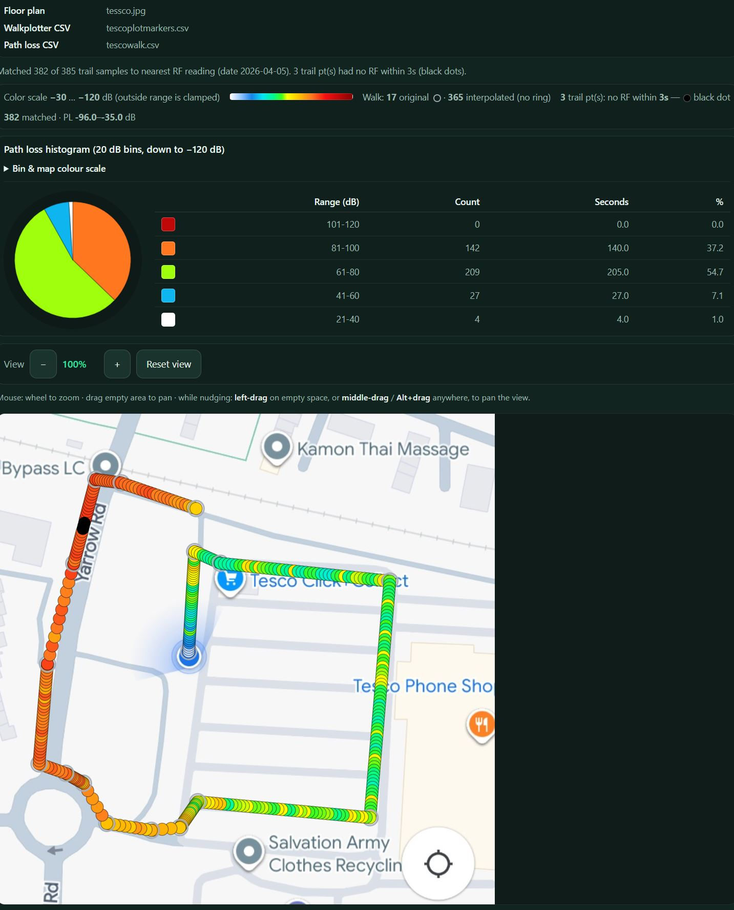

# Walkplotter

A small **offline-friendly** web app for walking a path on a floor plan: drop **trail** pins with timestamps, add **points of interest markers (POI markers)**—labeled pins not on the trail—pinch-zoom and pan, then export **CSV** (and optional map snapshot **JPG**). Built with **Vite** and **TypeScript**; runs in the browser with no backend.

**Typical use case:** **uplink signal coverage walk testing** alongside [**dBm-Now**](https://github.com/Cloolalang/dBm-Now-), an ESP-NOW path-loss / RSSI project. You walk the indoor coverage area with a **signal source** while Walkplotter records your **route on a floor plan** with timestamps; a **transponder** elsewhere receives the signal and logs **levels with timestamps** (for example via Serial CSV). **Post-processing the two timestamped CSV files** lets you align path and measurements to build **uplink coverage plots** for **in-building DAS** commissioning and design. As of **version 2.5**, the in-browser **Process** tab loads your Walkplotter export and merges **path-loss** and/or **RSSI** logs to the trail by time, then draws **coloured** markers—**dB** path loss or **dBm** received power—with optional **histogram**, **point labels**, thin **route** line, and **color-coded trail** (continuous ribbon the same width as the markers). **Plot overlay** runs the merge (you need at least one RF file); when both are plotted you can switch **Show → Path loss / RSSI**. No spreadsheet required for a first look.



---

## Features (short)

- Load a floor plan image; trail and POI markers are stored in **image pixel** coordinates. **Recent plans** on **Controls** reopens the last images from **IndexedDB** (no second file pick, within size/count limits). Optional **GitHub Pages** deploy (see **Setup on a computer**) serves the latest **`dist/`** at a **`github.io`** URL for use on a phone without copying files from a PC (needs internet).
- **Trail** mode records taps with local time; optional interpolation along straight segments when taps are more than 1 second apart.
- **POI** mode for separate labeled pins (anything you want to mark on the map without a timestamp); optional second CSV export (pixels only, no timestamps).
- **Map** / **Controls** / **Process** tabs: large map, tools and export, and **post-processing** (path loss and/or **RSSI** on the floor plan).
- Pin size, crosshairs, **Pause / Resume** on the **Map** tab (same button), optional **Snap angles** (90° or 45°) when placing trail pins—same geometry as **Process → Nudge trail → Snap angles** (incoming segment from the previous pin), undo, CSV download.
- **Map** session bar: **live clock** (updates every second)—**Local time** `HH:MM:SS` when using wall-clock timestamps, or **Elapsed** `H:MM:SS` after **Session t = 0**, matching the active export mode. **Pause** does **not** freeze this clock; it only stops new trail pins until you **Resume**.
- **Process bundle (JSON):** **Save process bundle** opens a dialog to **name** the download; one file embeds floor plan + Walkplotter CSV + path-loss CSV. **Load bundle** restores all three with a single file pick.
- **Process** tab: **zoom and pan** (View bar, wheel, drag; with **Nudge trail**, **left-drag** on empty space, **middle-drag**, or **Alt + drag** to pan); **nudge trail** pixels and **save** CSV; **Plot overlay** after choosing **Path loss CSV** and/or **RSSI CSV** (same **3 s** nearest-time match and `# test_date_local` date as path loss). **Path loss:** **−30…−120 dB** colours (**clamped**); optional **FSPL frequency estimate** (free-space **Δ** dB only—**indicative / experimental**; the FSPL bar is **hidden** while **RSSI** is the active overlay). **Bin & map colour scale** (path loss only): editable **stops** (−120…−30 dB) with color pickers update **map**, **histogram**, **pie**, and legend; **Reset to default** and **localStorage** persistence. **Histogram** + **pie:** **20 dB** bins for path loss (down to **−120 dB**); **10 dBm** bins for RSSI over **−120…−25 dBm**. **RSSI** uses a fixed **10 dBm-step** colour ramp (interpolated between stops): weak **−120 dBm** toward black, strong **−25 dBm** toward white, through reds, orange, yellow, green, and blues. **RSSI CSV:** columns **`time`** and **`rssi`** (case-insensitive header) or first two columns as time + dBm; **tab- or comma-separated**; wall-clock times may include **fractional seconds** (e.g. `15:43:58.783`); extra columns are ignored. If **both** RF overlays are present, **Show → Path loss / RSSI** switches map, legend, and histogram (**not** stored in the process bundle—bundle still embeds **path loss only**). Trail rows with **no RF sample within 3 s** are **solid black dots**. Optional **Point labels** (**dB** or **dBm**), **Show route**, **Color-coded trail** (**with 2+ plotted points** hides circular markers when the ribbon is on). **Original** walk samples use a **grey ring**; **interpolated** samples have **no ring**. **Clear overlay** removes path loss and RSSI plots. **Map** tab: optional **Session t = 0** so trail CSV timestamps are **elapsed** from a common start (aligned with zeroed hardware clocks).
- **Process → Overlay shift (Δx, Δy px):** moves the **entire** Process overlay (trail preview, RF markers, route, colour ribbon, labels, nudge crosshairs) in **intrinsic image pixels**—**display-only** until you **nudge** points and **save** the CSV. Helps when the **same** floor plan + walk file lines up on one device (e.g. phone) but sits **offset** on another (e.g. PC). **Positive Δy** draws lower on the image; **negative Δy** moves the overlay **up**. Persisted in **localStorage** (`walkplotter-process-overlay-shift-v1`); **Reset shift** clears to zero.

---

## Getting started (user manual)

### Open the app

Run the dev server (`npm run dev`) and open the URL shown in the terminal, or serve the **`dist/`** folder after `npm run build` (see **Setup on a computer** and **Android smartphone** below). The UI has three tabs: **Map** (full map), **Controls** (tools and export), and **Process** (combine trail and path-loss data on a plan).

### Load a floor plan

1. Open the **Controls** tab.
2. Tap **Choose floor plan** and pick an image (or use your project’s default test image if configured).
3. **Recent plans:** After you open an image from disk (Map **Choose floor plan**, drag-and-drop on the map, or **Process → Floor plan**), Walkplotter stores up to **eight** copies in the browser (**IndexedDB**, hashed by file content; max about **25 MB** per file—larger images are not kept). Under **Recent plans** on **Controls**, tap a name to load that plan again on the **Map** (clears trail and POIs like a new file pick). **×** removes an entry from the list only (not from disk). Clearing site data removes recents. The bundled `floorimage.jpg` default is **not** added automatically.
4. Return to **Map** to work on the image. Taps **on the image** count; taps on the letterboxed area outside the image are ignored.

### Trail mode (walked path with timestamps)

1. In **Controls**, ensure **Trail** is selected (not **POI**).
2. Tap the map to drop **trail pins**. By default each pin gets **local wall-clock** time; the exported CSV uses `HH:MM:SS` and a test date in the header. Optionally use **Map → Session t = 0** when you **zero tester and transponder clocks together**: timestamps export as **elapsed** time `H:MM:SS` from that instant (see **Session time zero** below). A badge shows when this mode is active; **Wall clock** returns to normal timestamps.
3. On the **Map** tab, **Pause** stops **new trail pins** only (for example before you move to another area); tap **Resume** on the same button to continue. The **map clock** (local or elapsed time in the session bar) **keeps running**—pausing does **not** stop it. Pausing inserts a **segment break** so the next tap does not connect with a line to the previous segment.
4. **Crosshairs** (optional) draws guide lines through your last **user** pin to help align the next tap along horizontal or vertical lines.
5. **Interpolation step**: if two trail taps are **more than one second apart**, Walkplotter adds synthetic points along the **straight line** between them, spaced by this interval (seconds). Adjust the value under Controls when a plan is loaded.
6. **Snap angles** (Map tab quick bar): **Off** (default), **90°**, or **45°**. When enabled, each new trail pin snaps so the segment from the **previous** pin lies on a horizontal, vertical, or (for 45°) diagonal—length is unchanged; the tap position is adjusted along that ray. There is nothing to snap after **Pause** (new segment) or on the **first** pin. This matches the **incoming-only** snap used while **nudging** dots on the **Process** tab (middle points there can also use both neighbors).

#### Session time zero (Map tab)

Use this when you want the trail CSV and your **path-loss log** to share the **same time base** after you reset hardware clocks.

1. On the **Map** tab (floor plan loaded, **Trail** mode), tap **Session t = 0** at the same moment you zero the **sender** and **transponder** (or immediately after). If you already have trail pins, Walkplotter asks to **clear the trail** first—start the walked path **after** t = 0 for a clean session.
2. While active, a **green badge** reads **Timestamps: elapsed from session t = 0**. The **Session t = 0** button is hidden; tap **Wall clock** to go back to normal local times (e.g. for a walk without hardware sync). The **clock** on the right of the bar tracks the same mode: **Elapsed** `H:MM:SS` live after t = 0, or **Local time** `HH:MM:SS` in wall-clock mode (both update every second while a floor plan is loaded, **including while trail recording is paused**).
3. Exported CSV includes `# timestamp_semantics: elapsed_since_session_start` and `# session_epoch_ms: …`. The first column is **elapsed** `H:MM:SS` from that epoch (not wall-clock time of day).
4. **Process tab:** Your **path-loss** and **RSSI** CSVs must use the **same** time convention as the trail: column 1 = elapsed `H:MM:SS` from **that** t = 0 (and the same `# session_epoch_ms` is embedded in the Walkplotter file so **Plot overlay** can align rows). If you only have wall-clock logs, use **Wall clock** on the map and do not use **Session t = 0**.

### POI mode (points of interest)

1. Select **POI** in Controls. Recording pause rules do not apply here; you can place POIs while the trail is paused or active.
2. Tap the map, enter a **label** in the dialog, and confirm. POI markers are **red labeled pins**, not linked to the trail, and have **no timestamps**.
3. Use **Undo POI** / **Clear POI** to remove the last POI or all POIs.

### Map navigation and appearance

- **Pinch** to zoom, **drag** with one finger to pan. On a **desktop**, **mouse wheel** zooms and **drag** pans the map. Under Controls, use **Map** − / + and **Reset view** if you prefer buttons.
- **Pin size** scales trail pins, the trail line, and POI markers on screen (export coordinates are unchanged).

### Exporting data

| Action | What it does |
|--------|----------------|
| **Download CSV** | Downloads the **combined** CSV: trail section (if any) plus a **POI markers** section in the same file when you have POIs. Enabled when you have at least one trail pin or one POI. |
| **POI CSV** | Downloads a **POI-only** CSV (label + `x,y` image pixels, no timestamps). Enabled when you have at least one POI. |
| **Stop & save…** | Opens a **Save** dialog: choose file names, optionally add a **map snapshot JPG**, and optionally a **separate POI-only CSV**. Available while recording **or** after **Pause** if you have trail and/or POI data to export. |

**Save dialog notes**

- If you have a **trail**, you name the **trail CSV** first. Trail and POI can live in that single file; a **separate POI CSV** is **optional** and is **off by default**—turn it on only if you want that extra file.
- If you have **only POIs** (no trail pins), there is no trail CSV field. Choose whether to **save POI markers as CSV** and/or a **JPG**; you must enable **at least one** of those (or cancel).

### Process tab (path loss, RSSI, and overlay on the floor plan)

Use this after you have a **Walkplotter trail CSV** (from **Download CSV** or **Stop & save…**) and at least one of: a **path-loss log** as CSV from your receiver/tooling, and/or an **RSSI log** (dBm vs time). All processing stays in the browser.

For **best usability**, do the **Process** tab work on a **PC with a mouse** (wheel zoom, pan, and nudge trail are tuned for that). A phone or touchscreen still works, but desktop is more comfortable for zooming, panning, and dragging trail points.

**Process floor plan view:** After you load a floor plan, use the **View** bar (− / + / **Reset view**) or the **mouse wheel** over the plan to zoom; **drag** on empty space to **pan**. With **Nudge trail** on, **left-drag** on empty space (not on a trail dot) pans the view like the middle button; **middle-drag** or **Alt + drag** still work anywhere on the overlay. Touch devices can use **pinch** to zoom and two-finger gestures where supported.

**Original vs interpolated trail points:** The Walkplotter CSV marks each row with a **source** (`user` = your taps, `interpolated` = synthetic points along straight segments). On the Process map, **original** points show a **grey ring** around the dot; **interpolated** points have **no ring** (green trail before **Plot overlay**). After plotting, the same ring convention applies when **disks** are drawn; turning **Color-coded trail** on with **two or more** points hides disks and shows only the ribbon. Fill colour encodes the active metric—**path loss (dB)** or **RSSI (dBm)**—where markers or the ribbon are shown. A **legend** lists original vs interpolated counts when relevant.

1. Open the **Process** tab.
2. Choose **Floor plan** (the **same** image as the walk) and **Walkplotter CSV**. The trail appears as green dots (and a line); **original** vs **interpolated** samples match the **grey ring** / **no ring** rule above. The CSV should include `# test_date_local: YYYY-MM-DD` for time alignment when you plot.
3. **Optional — straighten the trail:** turn on **Nudge trail**, then **drag** dots to adjust **image pixel** `x,y` in memory (nudge works at any zoom level). **Snap angles** can lock segments to **90°** (horizontal/vertical) or **45°** (8-way): from the **previous** point only at the **start** of the trail, from the **next** point only at the **end**, and using **both** neighbors for **middle** points (intersection of snapped incoming and outgoing directions). Use **Reset trail** to reload pixels from the file you chose. When satisfied, use **Save as edited copy** (`…-edited.csv`) or **Save (original name)** so the browser’s save dialog can replace the loaded file if you choose the same path. **Plot overlay** always uses the trail **currently in memory** (including unsaved nudges).
   **Optional — overlay alignment:** If the trail and RF markers look **vertically or horizontally shifted** on this screen (sometimes seen when moving the **same** walk CSV between Android and desktop **Process**), use **Overlay shift** — **Δx** and **Δy** in **intrinsic image pixels**. All overlay drawing uses `(x + Δx, y + Δy)`; **nudge** hit-testing matches what you see, and dragging still writes **unshifted** coordinates to the trail so the CSV stays consistent until you save nudges. **Reset shift** sets **0, 0**; values persist in **localStorage** (`walkplotter-process-overlay-shift-v1`). This does **not** replace fixing the root cause (layout / letterboxing differences); it is a practical **visual alignment** control.
4. **Path loss CSV (optional if you use RSSI instead):** comma-separated rows: **column 1** = time as `HH:MM:SS` (**wall-clock** trail) or **H:MM:SS elapsed** from session t = 0 if the Walkplotter export uses **Session t = 0** (match your logger to the same t = 0). **Column 4** = path loss (dB from your test gear). Lines starting with `#` are ignored.
5. **RSSI CSV (optional if you use path loss instead):** a row with headers **`time`** and **`rssi`** (any case), or **two columns** interpreted as time then RSSI in **dBm**. **Tab- or comma-separated**; times may include **fractional seconds** (e.g. `15:43:58.783`). Extra columns after RSSI (e.g. latitude) are ignored. Lines starting with `#` are ignored.
6. Tap **Plot overlay**. You need **at least one** of path loss or RSSI selected. Each trail sample is matched to the **nearest** RF row of each loaded type in time (same `# test_date_local` date), within **3 seconds**. Re-plotting with only one file type selected **clears** the other overlay from memory. If there is **no** RF row that close for the active metric, that trail position is still drawn as a **solid black dot**—common in **weak-signal** areas where the logger may be **sparse**.
7. **Optional — FSPL frequency estimate (path loss only):** After plotting path loss, turn on **FSPL frequency estimate**. Your walk is always at **2.4 GHz** — choose **Measured at (2.4 GHz)** (**2400** or **2474** MHz, default **2474**). Pick **Estimate at** (**700–2300 MHz**, 50 MHz steps) for the band you care about. The app applies only the **free-space** frequency term: **PL_est = PL_meas + 20·log₁₀(f_est / f_meas)** when your CSV uses **positive** path loss (dB). If your gear reports path loss as **negative** numbers (e.g. −51 dB), the app **flips the sign** of that correction so a **lower** estimate frequency still moves values toward **less** loss (less negative). The FSPL strip is **hidden** when **Show → RSSI** is selected (RSSI is not frequency-scaled here).

   **Limitations (read this):** The FSPL estimator is **not** a full propagation model. It does **not** account for **antenna performance** (gain, pattern, efficiency) at the estimate frequency vs 2.4 GHz, **in-building clutter** and multipath, **absorption** in walls and materials, **body / furniture** loss, or **cable and connector** losses. It is **indicative and experimental**—a quick free-space **what-if** for the same geometric path—not a substitute for measurements, drive tests, or proper modeling at the target band.
8. **Map (after plotting):** Each matched sample is placed at trail coordinates. **Path loss:** **circles** / ribbon use the **interpolated** colour scale between editable **stops** from **−120** (weak) to **−30** (strong); out-of-range values **clamp**. **RSSI:** fixed **10 dBm** colour stops from **−120** to **−25 dBm** (clamped); histogram uses **10 dBm** bins over that span. **Original** samples: **grey ring**; **interpolated**: **no ring** (legend summarizes counts). When **both** path loss and RSSI overlays exist, use **Show → Path loss / RSSI** to switch map, legend, and histogram. Optional toggles (toolbar):
   - **Point labels** — **dB** (path loss) or **dBm** (RSSI) next to each sample (offset adjusts if markers are hidden).
   - **Show route** — thin semi-transparent polyline along consecutive plotted points in walk order.
   - **Color-coded trail** — continuous stroke **along the same path**, **line width = circle diameter**, each segment a **linear gradient** between the two endpoints’ colours. With **two or more** points, **markers and rings are hidden** so only the ribbon is drawn; with **one** point, the disk is still shown (no segment to form a ribbon).
   - **Histogram** — **Path loss:** 20 dB bins down to **−120 dB** loss; **Range** column uses positive loss magnitude with **non-overlapping** integer endpoints between rows (e.g. **81–100** then **101–120**). **RSSI:** 10 dBm bins, signed **dBm** ranges in the table. **Count**, **Seconds** (sum of trail time to the next plotted point for samples in that bin), and **%**; first column is a **swatch** (mid-bin colour). **Pie chart** uses the same **%** per bin. For path loss only, expand **Bin & map colour scale** to edit stop colours (**localStorage**, key `walkplotter-process-pl-stops-v3`); **Reset to default** restores the built-in ramp. RSSI colours are fixed in the app (no per-stop editor in this version).
9. **Clear overlay** removes path loss and RSSI overlays and the histogram so you can **nudge the trail** again; it does not reload the CSV files from disk.
10. **Save process bundle** / **Load bundle:** After the three inputs are in place (**floor plan**, **Walkplotter CSV**, **path loss CSV**; RSSI is **not** embedded today), you can **Save process bundle**—a dialog lets you **choose the download file name** (default `walkplotter-process-bundle-…json`; `.json` is added if omitted). The file embeds the **floor plan** (base64), the full **Walkplotter CSV** (including nudges), and the **path-loss CSV** text. **Load bundle** restores those three with a **single file pick**—pick **RSSI CSV** again separately if you use it. Large images make **large** JSON files; the format is version **1** and may be extended later.

Selected file **names** are listed under the buttons so you can confirm what is loaded. Changing the **floor plan** clears the Walkplotter, path-loss, and RSSI selections so coordinates stay consistent.

**Summary:** maximum tolerated **timestamp offset** between a trail row and the RF row used for it is **3 seconds** (nearest-neighbor within that window). Trail points **outside** that window are still shown as **black dots** so you can see where the log did not line up in time.

**How RF values are chosen:** Walkplotter does **not** linearly interpolate **between** receiver measurements. For each trail row (including interpolated trail points), it uses the **value from the single nearest** log row in time, as long as that row is within **3 seconds**—separately for path loss and for RSSI when both are plotted. The plotted colour always reflects an **actual** value from your log, not a blend of two samples. Timestamps must align with `# test_date_local` (and elapsed semantics must match between trail and log when using **Session t = 0**).

### Tips

- **Undo trail** / **Clear trail** affect only the walked path; POIs are separate.
- After **Pause**, you can still use **Stop & save…** or **Download CSV** so you do not need trail pins to finish a POI-only session.
- All coordinates are stored in **image pixel** space (origin top-left), matching the floor plan file.
- **Process:** Use **Clear overlay** to remove path loss / RSSI plots and the histogram and **nudge** the trail again (CSV files stay selected; reload the walk file if you need a fresh copy). Combine **Show route** with or without **Color-coded trail** depending on whether you want a thin reference line under or beside the ribbon. **Bin & map colour scale** (path loss) persists via **localStorage** even when the plot is cleared; **Reset to default** is per-browser only (not in exported CSV or bundle JSON). **RSSI** colours are built-in (not editable in the UI yet). **Overlay shift** is separate from nudge: it only moves the **drawn** overlay; use **Reset shift** when you switch projects or after you have corrected pixels with **nudge** + **save** if you no longer need a display offset.
- **FSPL frequency estimate:** Free-space math only—no antennas, clutter, or absorption (see step 6). Treat as **indicative**, not a commissioning guarantee.

---

## Known issues and bugs

- **Process tab — Chrome on Android:** Choosing **Walkplotter CSV**, **Path loss CSV**, **RSSI CSV**, or **Load bundle** may open **Camera** or **Photos** instead of a file/documents picker. This comes from mobile Chrome’s handling of file inputs on many devices; several UI and `accept`-attribute workarounds have not fixed it reliably here. **Practical workaround:** run **Process** in a **desktop** browser, or copy the CSVs / bundle to a PC and load them there. (Floor plan + **Map** / **Controls** use on Android is unaffected.)

---

## Prerequisites (on your PC)

- [Node.js](https://nodejs.org/) (LTS is fine)

---

## Dependencies (build) and tested browser

The app itself has **no runtime npm dependencies**; the UI is bundled for static hosting. **Development / build** tools are listed in `package.json` and resolved in `package-lock.json`. Current locked versions:

| Package | Version |
|---------|---------|
| [TypeScript](https://www.typescriptlang.org/) | 5.9.3 |
| [Vite](https://vite.dev/) | 8.0.3 |

**Tested on Android:** **Google Chrome** version **111.0.5563.116** (floor plan loading, trail/POI, pinch–zoom, pan, CSV/JPG export over local HTTP).

---

## Setup on a computer

```bash
cd walkplotter
npm install
```

### Development server

```bash
npm run dev
```

Then open the URL shown in the terminal (default port **4173**). On a phone on the same Wi‑Fi, use your PC’s LAN IP, e.g. `http://192.168.1.50:4173` (firewall may need to allow the port).

### Production build

```bash
npm run build
```

Output is in the **`dist/`** folder. That folder is what you copy to the phone for offline use (see below).

### GitHub Pages (latest `dist/` on the phone, no PC copy)

The **`dist/`** folder is **not** committed to git (see `.gitignore`). The repo includes **`.github/workflows/pages.yml`**, which on every push to **`main`** runs **`npm ci`** and **`npm run build`**, then uploads the built **`dist/`** to **GitHub Pages** so you always get the same output as a local `npm run build`.

**Enable Pages (repository owner — do this once):**

1. Open the repo on GitHub (e.g. `https://github.com/Cloolalang/walkplotter`).
2. Go to **Settings** (repo tabs).
3. Open **Pages** in the left sidebar.
4. Under **Build and deployment** → **Source**, select **GitHub Actions**.  
   Do **not** choose “Deploy from a branch” for this project—the static site comes from the workflow artifact, not a `gh-pages` branch.
5. Save if prompted. The **Deploy to GitHub Pages** workflow will run on the next push to **`main`**, or you can start it manually: **Actions** → **Deploy to GitHub Pages** → **Run workflow**.

**After a successful deploy:**

6. Open **Actions** and confirm the latest **Deploy to GitHub Pages** run finished with a green check.
7. The app is served at the project Pages URL (default pattern):

   **`https://<github-username-or-org>.github.io/<repository-name>/`**

   For this repository that is **`https://Cloolalang.github.io/walkplotter/`** unless you renamed the fork or org.

**On Android (away from your PC):**

8. With **Wi‑Fi or mobile data** on, open that URL in **Chrome**.
9. You are loading the **latest build from `main`** (after the last successful deploy). Bookmark the page or use **Add to Home screen** (see below)—same steps as for a local URL, but use the `github.io` link.
10. **Limitation:** You need **internet** to load or hard-refresh the app. This does **not** replace copying **`dist/`** to the phone and using **Simple HTTP Server** for use with **no** network.

If a workflow run fails, check **Actions** logs (usually `npm ci` / TypeScript). Ensure **Settings** → **Actions** → **General** allows workflows to run and that **Pages** still has **Source: GitHub Actions**.

---

## Android smartphone: offline use with **Simple HTTP Server** + **Chrome**

Opening `dist/index.html` directly from storage often **fails** in mobile Chrome (modules / security). Serving the folder over **HTTP on the device** avoids that and works **fully offline** after the files are on the phone.

**Online alternative:** To use the newest build **without** copying `dist/` from a PC, first enable **GitHub Pages** (previous subsection) and open your **`https://….github.io/…/`** URL in Chrome when you have internet.

### 1. Build on your PC

```bash
npm run build
```

### 2. Copy `dist` to the phone

Copy the entire **`dist`** directory (including the **`assets`** folder next to `index.html`) via USB, cloud drive, etc. For example: `Downloads/walkplotter-dist/`.

### 3. Install a tiny HTTP server app

Examples: **Simple HTTP Server** (Phlox) or similar from the Play Store—anything that lets you pick a **folder** and start a server on **127.0.0.1**.

### 4. Point the app at your `dist` folder

- **Document root / web root** = the folder that **contains** `index.html` (not its parent).
- Start the server and note the port (e.g. **8080**).

### 5. Open in Chrome

On the phone, in **Chrome**, open:

**`http://127.0.0.1:8080/`**

(use your app’s actual port). Use **127.0.0.1** for “this phone only”—no internet required.

If the app shows a **public/WAN** IP, ignore it for local-only use; **127.0.0.1** is the right address here.

### 6. Updating the app

After you change the project on the PC, run `npm run build` again and **replace** the `dist` contents on the phone, then refresh the page in Chrome.

---

## Add Walkplotter to your Android home screen

This gives you a one-tap shortcut (usually full-screen Chrome without the address bar after launch).

1. With Walkplotter open in **Chrome**—either your **local** URL (`http://127.0.0.1:…` with Simple HTTP Server) **or** your **GitHub Pages** URL (`https://….github.io/walkplotter/`).
2. Open Chrome’s menu (**⋮**).
3. Choose **Add to Home screen** or **Install app** (wording varies by Chrome version).
4. Confirm the name and add the icon.

**Note:** The shortcut always opens **that exact URL**. For **`127.0.0.1`**, start **Simple HTTP Server** before tapping the icon. For **GitHub Pages**, you need **internet** when you open the shortcut.

---

## Permissions note (Simple HTTP Server)

Some server apps ask for broad storage access so they can read any folder you select. If you prefer not to grant that, alternatives include **Termux** (`python -m http.server` in the `dist` directory) or packaging the app with **Capacitor** (no separate server app).

---

## Project scripts

| Command        | Purpose                          |
|----------------|----------------------------------|
| `npm run dev`  | Dev server (default port 4173)   |
| `npm run build`| Typecheck + production `dist/`   |
| `npm run preview` | Serve `dist/` locally (test) |

---

## Planned features

### Split a long path-loss CSV using Walkplotter exports (**not implemented**)

**Problem.** A **static receiver** often produces **one continuous** path-loss log (timestamps keep increasing) while you complete **several** walk sessions: different floor plans, moves between areas, gaps between walks. Walkplotter saves **one trail CSV per session**. Today you must **manually slice** the master RF file by time to match each trail before using **Process** (spreadsheet filter, script, etc.).

**Idea.** Add a tool in the app (likely on **Process** or **Controls**) that:

1. Loads a **master path-loss CSV** (full receiver run).
2. Loads **one or more Walkplotter CSVs** already exported for each walk area.
3. Derives a **time window per walk** from each file’s **trail rows** (min/max timestamp in the file’s stated semantics) plus header metadata where needed: `# test_date_local`, `# timestamp_semantics`, `# session_epoch_ms`, so **wall-clock** and **elapsed** modes stay consistent with the receiver log.
4. Emits **separate path-loss CSV files** (or a single downloadable archive)—each slice contains RF rows whose times fall inside the corresponding window, optionally with a small configurable **padding** (e.g. ±few seconds) so edge matches behave like **Process** today.
5. Optionally names outputs to pair with each Walkplotter file (e.g. same basename + `-pathloss-slice.csv`).

**Edge cases to design later:** overlapping walk windows if the same plan is walked twice the same day; receiver lines starting with `#`; RF rows outside every window; very long gaps (no RF during transit).

**Status.** **Planning only**—no implementation in the codebase yet.

### Real-time plotting (MQTT / [**dBm-Now**](https://github.com/Cloolalang/dBm-Now-) two-way mode) (**not implemented**)

**Problem.** **Process** today is **post hoc**: you export a trail CSV and a path-loss log, then merge in the browser. During the walk you see the route but not live RF tied to each step.

**Idea.** Support **live** path-loss (or RSSI) on the map while you walk:

- **MQTT** — subscribe to a broker topic where the receiver (or a bridge) publishes timestamped measurements; Walkplotter **matches** incoming samples to the current trail by time (same clock / session rules as today) and updates markers or a “last known” plot without waiting for CSV export.
- **dBm-Now two-way mode** — coordinate with [**dBm-Now**](https://github.com/Cloolalang/dBm-Now-) (or compatible tooling) so the phone can **receive** streaming measurements over the same ecosystem the project already targets (**ESP-NOW**, serial, etc.), with a defined message shape and optional **ack** / **control** channel (“two-way”) for session boundaries, rate limits, or health checks.

**Design questions for later:** transport when offline (local broker vs device AP), battery and reconnect behaviour, security (TLS, device pairing), backward compatibility with **CSV-only** workflow, and whether live mode feeds **Process** history or only **Map** preview.

**Status.** **Planning only**—no implementation in the codebase yet.

---

## Development

This project was developed using [Cursor](https://cursor.com/).

---

## License

**Walkplotter** is free software; you can redistribute it and/or modify it under the terms of the **GNU General Public License version 2** (or, at your option, any later version). See the [LICENSE](LICENSE) file in this repository for the full text.

THE SOFTWARE IS PROVIDED "AS IS", WITHOUT WARRANTY OF ANY KIND, EXPRESS OR IMPLIED, INCLUDING BUT NOT LIMITED TO THE WARRANTIES OF MERCHANTABILITY, FITNESS FOR A PARTICULAR PURPOSE AND NONINFRINGEMENT.
